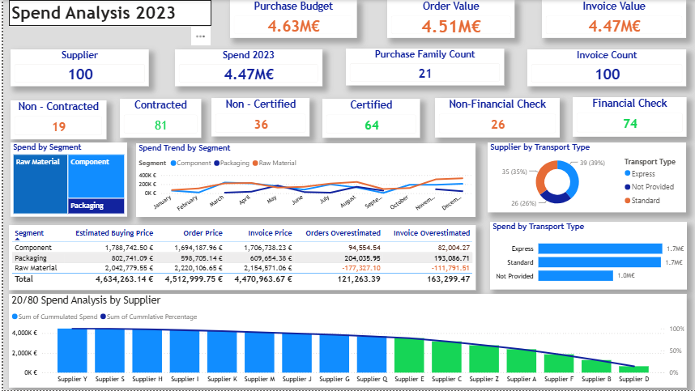

# Spend Analysis & Procurement Performance Dashboard

## Overview

An end-to-end Power BI dashboard analysing FY2023 procurement spend for a manufacturing purchasing organisation. It brings budget and order data into a single model to give finance, procurement, and senior leadership one reliable view of spend performance, budget variance, and supplier risk, instead of reconciling separate spreadsheets by hand.

## Business Question

Where is the €4.63M procurement budget actually going, which suppliers carry the most spend and risk, and which article segments are driving cost overruns versus savings?

## Dataset

Two linked tables, 100 rows each, modelled together on Article ID:

* **Order Table**: one row per transaction. Article ID, Purchase Family, Article Segment, Order Price, Supplier Name, Lead Time (weeks), Transaction ID, Order and Shipment Dates, Transport Type, Invoice Price.
* **Budget Table**: one row per article. Supplier Contract status, Financial Health Check, Quality Certificate Check, Estimated Buying Price.

100 purchase orders were placed across **16 distinct suppliers** and **21 purchase families**, spanning three article segments: Raw Materials, Components, and Packaging.

This is a synthetic dataset built to mirror a realistic industrial purchasing structure, with article segments weighted by intended budget share, supplier pools segmented by product family, and an estimated buying price set as the benchmark against which realised order and invoice price are measured.

## Methodology

* **Data modelling**: cleaned and typed both tables in Power Query, then related them on Article ID for cross-table analysis.
* **Budget variance measures**: DAX measures comparing Estimated Buying Price against realised Order Price and Invoice Price, both in aggregate and broken down by Article Segment, to isolate exactly where overruns and savings occur.
* **Pareto (80/20) supplier concentration**: built natively in Power Query rather than DAX. The order table was duplicated and grouped by supplier to get total spend per supplier, sorted descending, and given an index column. That table was then self-joined against itself using the index, producing a running cumulative spend total for each supplier in rank order. A DAX measure then calculates each supplier's cumulative share of total spend, and conditional formatting flags suppliers who fall inside the top 80% of cumulative spend in green, with the long tail in orange, directly on the bar chart.
* **Compliance and risk flags**: Supplier Contract, Financial Health Check, and Quality Certificate Check are surfaced as article-level risk indicators, since a single supplier can carry multiple articles under different contract and certification terms.

## Key Findings (FY2023)

* **€4.51M** in realised order value and **€4.47M** invoiced, against a **€4.63M** estimated budget: a net **€121K (2.6%) favourable variance** overall.
* That favourable variance is not evenly spread. **Raw Materials ran about €177K over** its estimate, while **Packaging (about €204K under)** and **Component (about €95K under)** came in under estimate, and those two segments' savings absorbed the Raw Material overrun. Without that offset, the project would have closed over budget.
* Segment mix of realised order spend: Raw Materials roughly 49%, Component roughly 38%, Packaging roughly 13%.
* A small group of suppliers drives the majority of total spend. The Pareto analysis shows spend is heavily concentrated among the top few of the 16 active suppliers, a clear signal for where procurement should focus contract negotiation and risk mitigation effort rather than spreading attention evenly across all 16.
* **19% of articles (19 of 100)** have no signed supplier contract in place, a straightforward compliance gap for procurement leadership to close.
* **36% of articles** are sourced from suppliers without a current quality certificate on file. Certified suppliers account for the larger share of compliant, lower-risk spend.
* Transport spend splits close to evenly between Express and Standard shipment, with **26% of orders** missing a recorded transport type, a data quality gap worth closing before it becomes a blind spot in logistics cost analysis.

## Business Value

The dashboard enables stakeholders to:

* Monitor procurement performance against budget in real time, at both the portfolio and segment level.
* Identify cost overruns and compliance risks early, rather than discovering them at year-end reconciliation.
* Focus supplier negotiations and risk mitigation on the small number of suppliers driving the majority of spend.
* Support strategic sourcing and budget planning decisions from a single, reliable source of truth across budget and order data.

## Tools & Skills

**Tools**: Power BI, DAX, Power Query, Excel

**Skills demonstrated**: data modelling and cross-table relationships, DAX measure design, budget variance analysis, Pareto (80/20) analysis built in Power Query, supplier risk and compliance analysis, KPI design, executive-level dashboard design, data storytelling.

## A Note on Data Granularity

The Budget table is article-level, not supplier-level, so Contract, Financial Health, and Quality Certificate figures reflect the share of the 100 articles meeting each condition, not the share of the 16 suppliers. This distinction matters because a single supplier can hold multiple articles under different terms, and it is called out here rather than left implicit, since a dashboard is only as trustworthy as its labels are precise.

## Files in this Repository

* `Spend_Analysis_Procurement_Dashboard.pbix`, the full Power BI file.
* `Order_Table_2023.xlsx` and `Budget_Table_2023.xlsx`, the source data.
* `dashboard-overview.png`, a screenshot of the dashboard.
